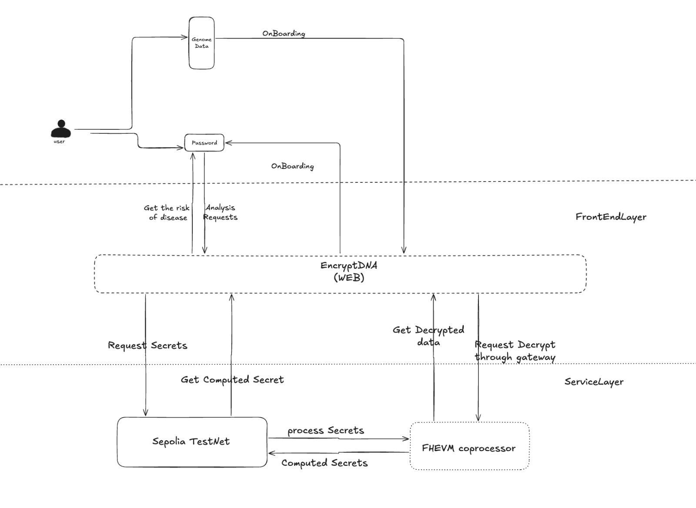

# EncryptDNA
Secure and sovereign personal genomics

Personal genomics services such as 23andMe and Ancestry.com have been delivering valuable health and ancestry insights to us. However, by using insecure methods and having a general lack of care, they have exposed our most critical biological data through breaches and unscrupulous sharing. Unlike national identifiers and even our names, we cannot change our DNA after a breach. Worse, genetic data can reveal some fundamental information about us which can be used to harm us in targeted ways. All this has made many people reluctant to use genomics for better healthcare, IVF, etc.

Our project, EncryptDNA, is an illustrative example of what a new paradigm of privacy respecting personal genomic services might look like. With the help of Zama FHEVM using blind computing and zero knowledge technology we show what the whole ecosystem looks like when we prioritize user privacy. We envision a future in which people own their own genomic data with no compulsion to reveal it to any providers and still enjoy the benefits of this rapidly evolving field.

## Basic Flow:
Once someone obtains their raw DNA file from a provider, the EncryptDNA Portal at https://encrypt-dna.vercel.app/ allows them to upload their data and receive a DNA Passport. In the background, the raw data is processed (and then discarded) and portions of it are stored as secrets on the Sepolia network using FHEVM . The actual DNA Passport handed back to the user contains an identifier, some useful hashes and metadata about stored secrets on the Sepolia network using FHEVM. The Portal and the Passport act as the focal points of the ecosystem.User can upload this passport to url https://encrypt-dna.vercel.app/results and get to know about the various details like what is the risk of thrombosis, diabetes etc. with a single click and without disclosing their genome data.

EncryptDNA accepts DNA Passports from users and uses the metadata to run a program on the users’ datasets. This program operates on encrypted data so no user data is ever revealed to EncryptDNA, neither raw genetic information nor identity information about users. After performing the available computations, EncryptDNA issues a results. We are using genetic thrombophilia as an example trait right now and several other traits can be easily added as needed.

## Implementation Details

The project uses actual dumps of genetic data from **23andMe**. Other providers’ file formats can also be easily supported. These files don’t contain the whole genetic sequence (which would be absolutely gigantic) but rather contain information about half a million single nucleotide polymorphisms (SNPs), e.g. rs6025, and their genotypes, e.g. AA, AG, GG, etc. Based on the SNP / genotype pairs we store, we are able to make deductions about health and ancestry traits of users, the same way that 23andMe and other services do.

As mentioned, we used **FHEVM** for confidential computing. As FHEVM is still being scaled, we kept things as simple as possible and only stored selected SNPs on the network for computation. The moment the constraint is removed, we will be able to run a plethora of programs on the secret data.

## Smart Contract Testing
You can visit the [Github repository](https://github.com/Jineshbansal/DNAEncryptionTesting). I have written extensive tests to minimize the risk of application breakdown and to ensure the smart contract logic functions as intended. I have written the tests in typescript.

## Demo Video Link
Click [here](https://www.loom.com/share/e72588920a51498ea3d93e2a1dd77cce?sid=170f410b-ef2e-4339-93e8-bc582c77cb9b) to see a working demo!

## Presentation Link
Click [here](https://www.canva.com/design/DAGZWgTL90o/sUj0Kg-rF7b-Y_nomW6aVQ/edit?utm_content=DAGZWgTL90o&utm_campaign=designshare&utm_medium=link2&utm_source=sharebutton)to see basic motivation behind our application and our Go-to-market strategy.

